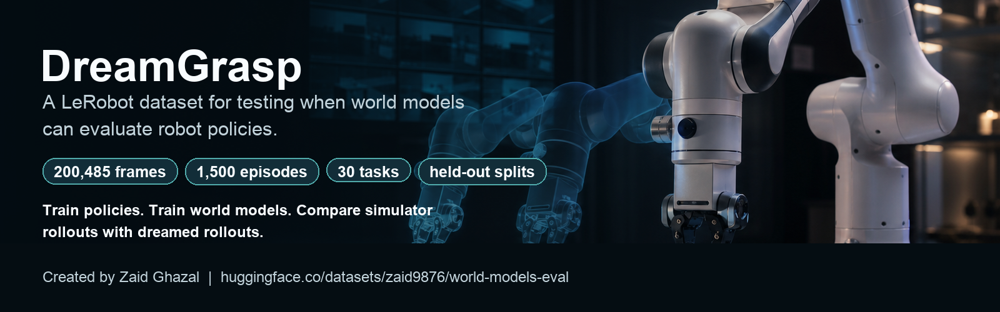

# DreamGrasp



**How good must a learned world model be before you can trust it to evaluate robot policies?**

DreamGrasp is a processed robotics dataset and single-GPU study harness for testing when
learned world models can be trusted to evaluate robot policies. It turns LIBERO manipulation
demonstrations into a LeRobotDataset-v3 release with fixed splits, held-out tasks,
normalization stats, policy/world-model training configs, simulator evaluation, and dreamed
rollout calibration.

This project **builds on** prior work in world-model-based policy evaluation — it does not claim to
invent it:

- **WorldEval** — [arXiv:2505.19017](https://arxiv.org/abs/2505.19017)
- **WPE (World-model-based Policy Evaluation)** — [arXiv:2506.00613](https://arxiv.org/abs/2506.00613)
- **Ctrl-World** — [arXiv:2510.10125](https://arxiv.org/abs/2510.10125)
- **SIMPLER** — [arXiv:2405.05941](https://arxiv.org/abs/2405.05941)
- **RoboWM-Bench** — [arXiv:2604.19092](https://arxiv.org/abs/2604.19092)

Our contributions are (1) the **DreamGrasp dataset** for policy/world-model evaluation,
(2) the **quality→reliability calibration curve** ("trust region"), and (3) the **open
single-GPU harness** that produces it.

## Status

Type 2 execution is in progress on the GPU machine. The current run log is
[`RUN_LOG.md`](RUN_LOG.md); commands and acceptance checks are in [`RUNBOOK.md`](RUNBOOK.md).

## Setup (macOS / Apple Silicon)

```bash
brew install ffmpeg git-lfs
conda create -n world-models-eval python=3.10 -y && conda activate world-models-eval
pip install -e ".[dev]"
pip install -e ./third_party/LIBERO --config-settings editable_mode=compat --no-deps
python scripts/smoke_test.py
```

macOS-specific workarounds are documented in [docs/macos.md](docs/macos.md).

## License

Apache-2.0. LIBERO (vendored under `third_party/`) is MIT-licensed — cite
[the LIBERO benchmark](https://arxiv.org/abs/2306.03310) if you use the processed dataset.
